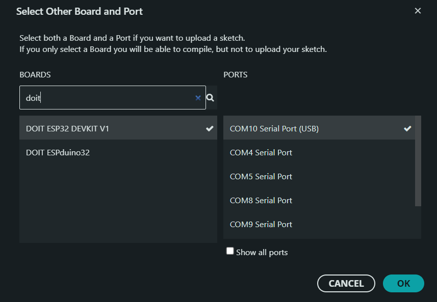
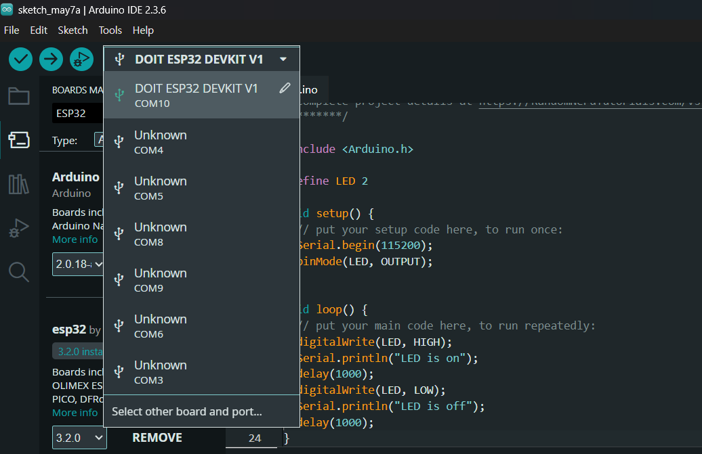

# IoT25-HW01

- Screenshots of Arduino IDE showing selected board & port

- Video of the ESP32 blinking LED
<video src="demo.mp4" width="320" height="240" controls> your borwser does not support the video tag</video>
